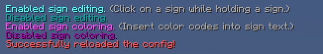

# YetAnotherSignEditor
Easily edit signs, with support for both MiniMessage and legacy formatting.

* [Downloads](https://github.com/TehBrian/YetAnotherSignEditor/releases/latest)
* [Discord](https://chat.tehbrian.xyz)
* [Donate](https://github.com/sponsors/TehBrian) <3

## Features

- Edit signs with a command or directly in the sign interface.
- Toggle plugin features per-player.
- Use either legacy color codes or [MiniMessage][MiniMessage] to format text.
- All plugin messages are easily configurable.
- Separate permissions for sign coloring and sign editing.

Above all, it just feels good to use! No bloat, no extra features.

[MiniMessage]: https://docs.adventure.kyori.net/minimessage.html

## Screenshots

## Permissions
The permissions can be found [here][plugin.yml].

[plugin.yml]: https://github.com/TehBrian/YetAnotherSignEditor/blob/master/src/main/resources/plugin.yml

## Building
This project uses Gradle. To build, run `./gradlew shadowJar` in the main
project directory. The built jar can be found in `build/libs`.

## Contributing
Feel free to submit a pull-request or file an issue! All changes are welcome. If
you're contributing code, please follow the project's code style.

## Alternate README.md
Do you prefer READMEs that talk to you directly (at the expense of being easy to
read)? Would you like to hear the "witty" comments of my 15-year-old self? Then,
oh *boy* have I got something for you! Head on over
to [OLD_README.md](OLD_README.md) and experience true enlightenment.
