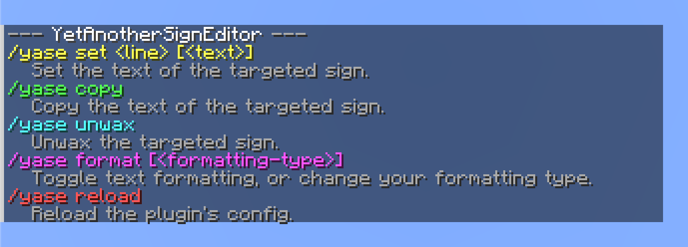
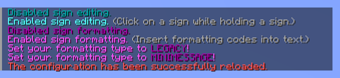

# YetAnotherSignEditor

Easily edit and format signs with both MiniMessage and legacy formatting.

* [Download](https://modrinth.com/plugin/yetanothersigneditor)
* [Discord](https://tehbrian.dev/discord)
* [Donate](https://github.com/sponsors/TehBrian) <3

---

## Features

- Format sign text with either [MiniMessage][MiniMessage] or legacy formatting.
- Each player can individually toggle formatting and switch their formatting type.
- Player settings are persisted across sessions.
- Need more space for formatting? Set sign text with `/yase set`.
- Copy sign text (with or without formatting) to your clipboard with `/yase copy`.
- Unwax signs with `/yase unwax`, or simply bypass the wax with `/yase open`.
- All plugin messages are configurable.

Put simply, this plugin *makes editing signs fun*.

- Edit signs with a command or directly in the sign interface.
- Toggle sign editing and sign formatting separately and per-player.
- Use either [MiniMessage][MiniMessage] or legacy formatting to format text.
- All plugin messages are easily configurable.
- Separate permissions for sign formatting and sign editing.

Above all, it just feels good to use! No bloat; no fluff.

[MiniMessage]: https://docs.papermc.io/adventure/minimessage/

## Screenshots

## Building

This project uses Gradle. To build, run `./gradlew build` in the project's root
directory. The built jar can be found in `build/libs`.
